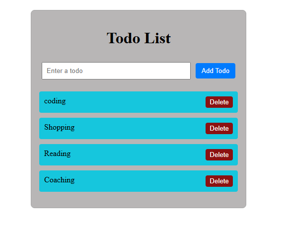
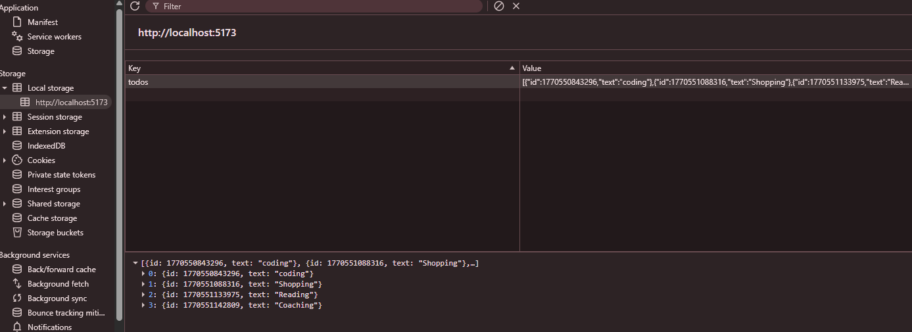

# 📝 React To-Do App with Local Storage

## 📖 Description
A simple and beginner-friendly React To-Do Application that allows users to add, delete, and persist tasks using the browser’s Local Storage.
This project is built using React functional components and React Hooks, without using any backend or database.

## 🚀 Features
- Add new tasks
- Delete tasks with a single click
- Tasks are saved in Local Storage
- Data persists after page refresh
- Built using React Hooks
- Clean and minimal UI

## 🛠️ Technologies Used
- React (JavaScript)
- React Hooks (useState, useEffect)
- Local Storage API
- HTML & CSS

## 📚 Concepts Covered
- Functional Components
- State Management using useState
- Side Effects using useEffect
- Event Handling (onChange, onSubmit, onClick)
- Dynamic Rendering with map()
- Data Persistence without Backend

## 📸 Screenshots

### 🏠 Main To-Do Interface


### 💾 Local Storage Persistence



## 📁 Project Structure
```
react-to-do/
├── src/
│   ├── components/
│   │   └── Todo.jsx
│   ├── App.jsx
│   └── main.jsx
```

## ▶️ How to Run the Project
1. Clone the repository:
   ```
   git clone https://github.com/your-username/react-todo-app-with-local-storage.git
   ```

3. Go to the project folder:
   ```
   cd react-to-do
   ```
5. Install dependencies:
   ```
   npm install
   ```

7. Start the development server:
   ```
   npm run dev
   ```

## 🎯 Learning Outcome
This project helps beginners understand how to:
- Build a real-world React application
- Manage form inputs and task lists
- Persist data using Local Storage
- Use React Hooks in a practical way

## 🔮 Future Enhancements
- Edit tasks
- Mark tasks as completed
- Add task priorities
- Improve UI with Tailwind CSS
